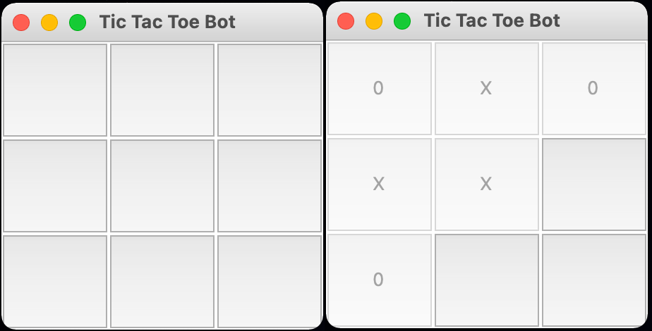
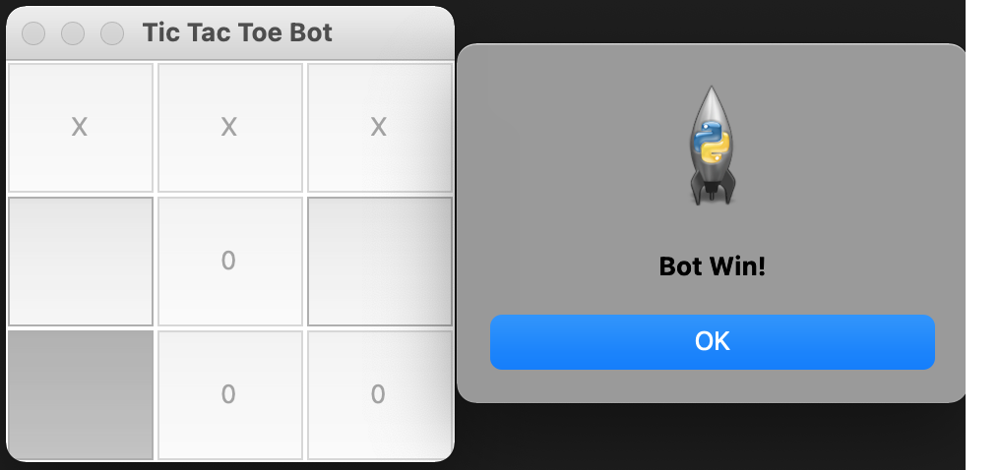

### AI Assignments

1. Build a simple Tic-Tac-Toe game using MinMax algorithm.
2. Calculate air quality index using Linear regression (you can use Beijing air quality index available, SK learn, SVM etc).
3. Estimate house rent using Linear regression (you can use available python libraries).
4. Implement Task 2 and Task 3 using Neural Network technics.
5. Build a simple Text suggesting system using bayes theorem.

### Solutions:

1. Tic Tac Toe bot game with Python tkinter GUI

	
	
	

2. Air quality index calculation using Linear Regression

3. House price prediction using Linear Regression

4. Task-2 and Task-3 using Neural Network

     1. Air quality index calculation using Neural Network
     2. House price prediction using Neural Network

5. Text prediction using trigram model based on bayes theorem

Dataset drive link
https://drive.google.com/drive/folders/1EP1CK1InS24bz0KCciTZgz4VUlX0LUHT?usp=sharing
